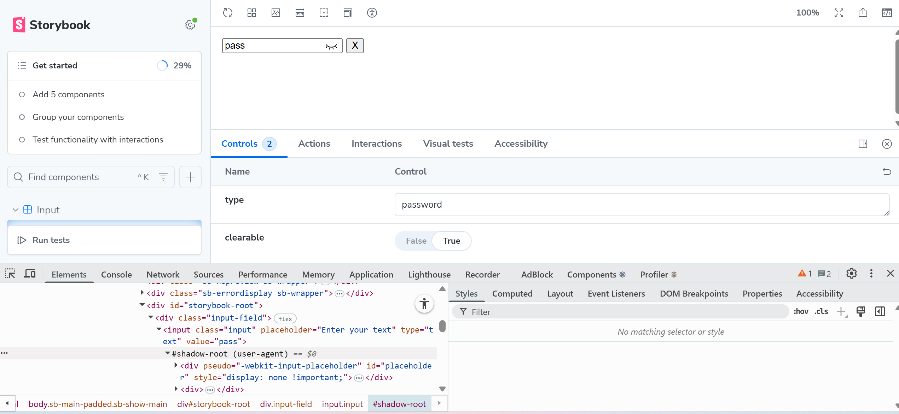
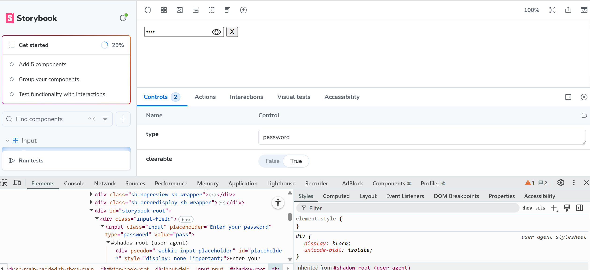
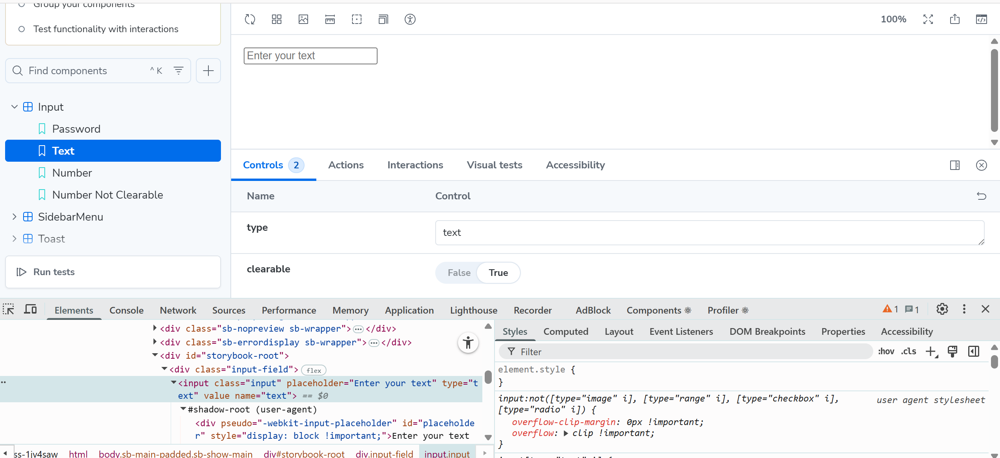
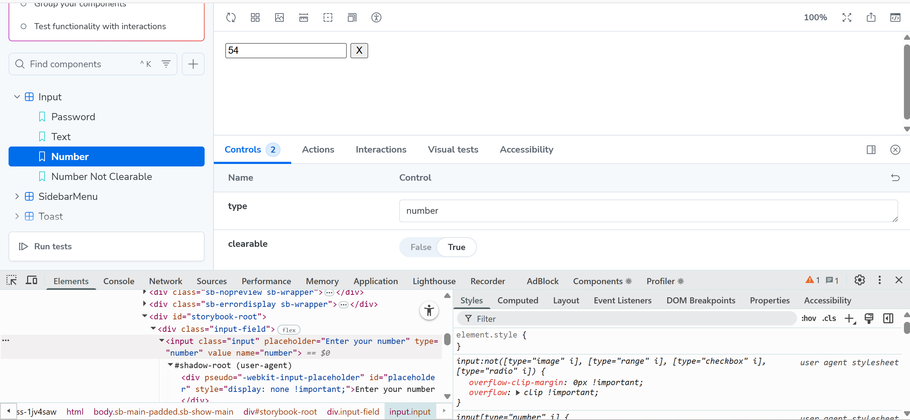
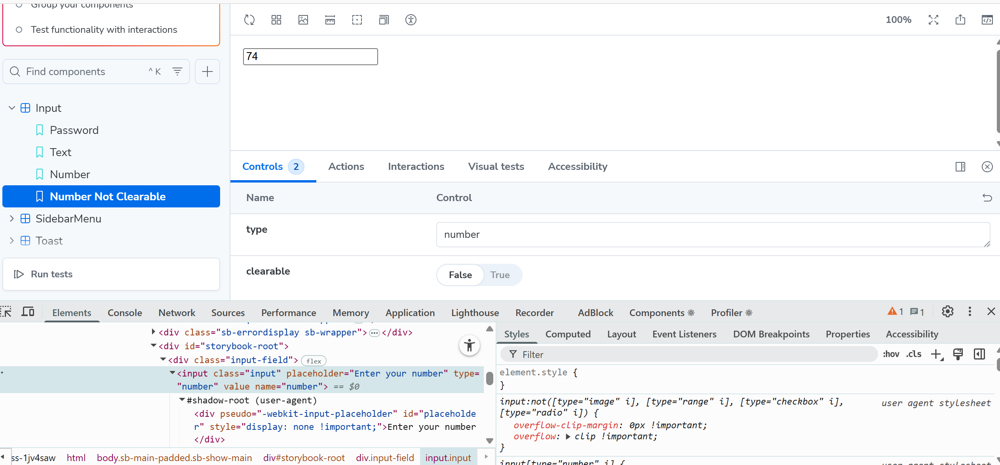
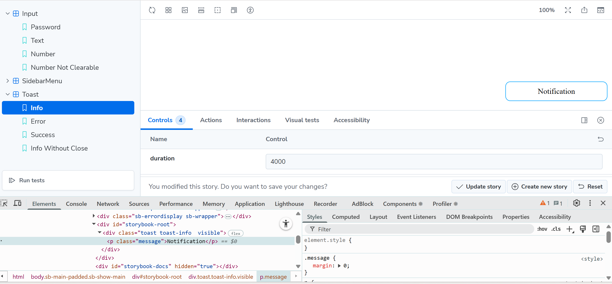
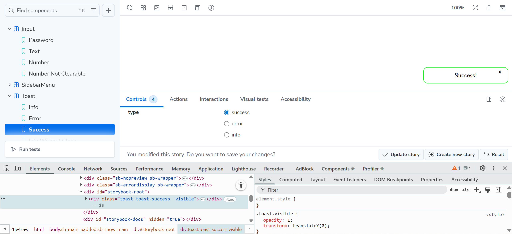
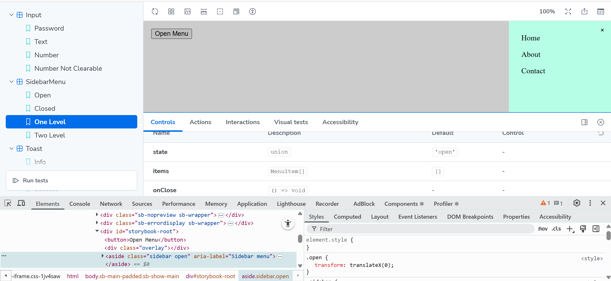
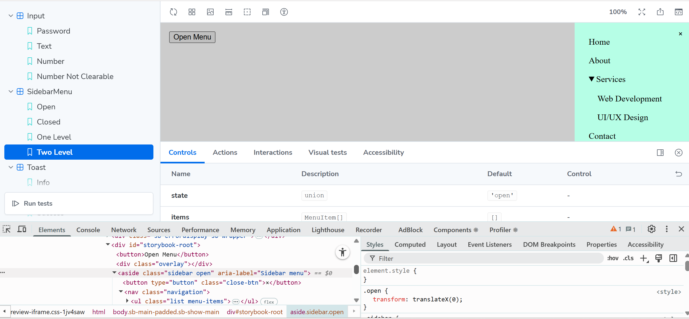
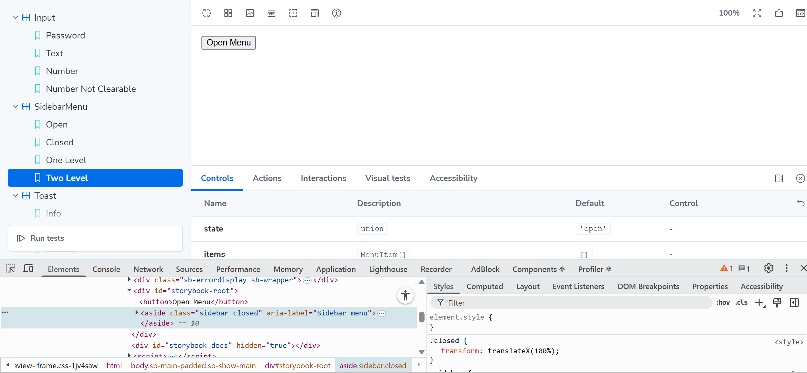

# React Components Assignment

## Setup Instructions

1. Install dependencies:

```bash
npm install
```

2. Run Storybook:

```bash
npm run storybook
```

## Input

- Input visible password  
  
- Input invisible password
  
- Input text empty
  
- Input number
  
- Input number not clearable
  

## Toast

- Toast info without close button
  
- Toast success with close button
  

## SidebarMenu

- SidebarMenu with 1-level nested items opened
  
- SidebarMenu with 2-level nested items opened  
  
- SidebarMenu closed
  
